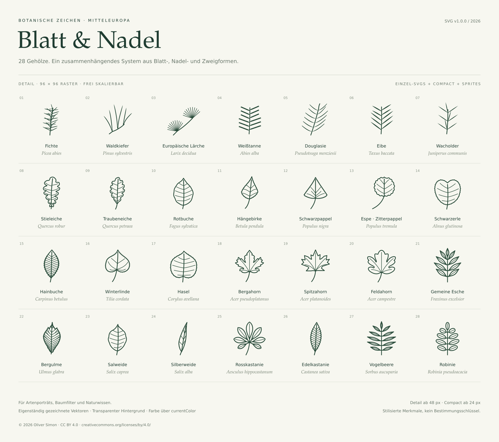

# Blatt & Nadel

**28 Gehölzarten · 56 SVG-Icons · v1.0.0**

Blätter, Nadeln und Zweige für Naturwebseiten, Artenporträts und Baumfilter. Zwei optisch abgestimmte Varianten verbinden charakteristische Pflanzenformen mit einer einheitlichen Zeichensprache.

[English](../README.md) · [Einbau](USAGE.md) · [Botanische Hinweise](BOTANY.md) · [Qualitätsprüfung](QUALITY.md) · [Changelog](../CHANGELOG.md)



## Sofort verwenden

Kopiere die gewünschten SVGs aus `icons/` oder `sprites/` in dein Projekt. Eine Installation ist dafür nicht nötig. Die Dateien lassen sich direkt in Vektorprogrammen bearbeiten.

| Variante  | Anzeigegröße | Einsatz                                         |
| --------- | ------------ | ----------------------------------------------- |
| `compact` | 24–40 px     | Filter, Navigation und kleine Bedienelemente    |
| `detail`  | ab 48 px     | Artenporträts; für feine Nerven besser ab 64 px |

Alle Icons nutzen einen 96 × 96-ViewBox, transparente Hintergründe und `currentColor`. Sie bestehen aus editierbaren Vektorpfaden, ohne Rasterbilder, Schriften, Skripte oder externe Ressourcen.

```html
<svg width="32" height="32" viewBox="0 0 96 96" aria-hidden="true"
     style="color: #34573e">
  <use href="/sprites/leaves-compact.svg#leaf-rotbuche"></use>
</svg>
<span>Rotbuche</span>
```

Externe Sprites über HTTP(S) auf derselben Domain wie die Webseite bereitstellen. Bei Verwendung als `` wird die CSS-Textfarbe der Webseite nicht übernommen. Weitere [Einbaubeispiele und Hinweise zur Barrierefreiheit](USAGE.md).

## Die Sammlung ansehen

`index.html` enthält eine Galerie mit Suche, Variantenwechsel, Größenregler, Farbwahl, dunklem Hintergrund sowie Kopier- und Downloadfunktion. Die [Größenübersicht](sizes.png) zeigt jede Art bei 24, 32, 48 und 64 px.

Für die Sprite-Beispiele genügt ein lokaler Server:

```sh
npm run serve
# http://127.0.0.1:8080
```

## Entwickeln

Node.js 24 verwenden, dann `npm ci` ausführen. Die SVGs in `icons/` sind die editierbaren Originalquellen. Nach Änderungen:

```sh
npm run format
npm run build
npm run render:preview
npm test
npm run format:check
```

Zusätzliche Browserprüfungen:

```sh
npx playwright install --with-deps chromium firefox
npm run test:browser
```

Die automatischen Prüfungen erfassen unter anderem XML, Metadaten, Konturüberschneidungen und überlappende Teilblattstriche, aus der Blattfläche herausragende Adern und Mittelrippen einschließlich ihrer Strichbreite, unbeabsichtigt freistehende Nadeln, abgeschnittene Zeichnungen und veraltete generierte Dateien. Die Browserprüfung kontrolliert die Galerie und alle 56 Sprite-Symbole in Chromium und Firefox. [Prüfumfang und Grenzen](QUALITY.md).

Ein geprüftes Release-Archiv erzeugen `npm run test:release` und `npm run release`. Die [Release-Anleitung](PUBLISHING.md) erklärt den Ablauf.

## Botanische Einordnung

Die Zeichnungen betonen Blattform, Blattstellung, Lappen und relative Stiellängen. Sie zeigen jeweils eine typische Ausprägung und bleiben botanisch informierte Stilisierungen. Natürliche Variation, Nadelquerschnitte, Behaarung und vollständige Nerven- oder Nadelzahlen sind in kleinen Icons nicht vollständig darstellbar. Die [botanischen Hinweise](BOTANY.md) dokumentieren für alle 28 Arten die Quellen sowie die erhaltenen und ausgelassenen Merkmale beider Varianten. Das Set ist keine unabhängig begutachtete wissenschaftliche Bildtafelserie und kein vollständiger Bestimmungsschlüssel.

## Lizenz

**Icons, Vorschauen, Dokumentation und botanische Metadaten: [CC BY 4.0](../LICENSE), © 2026 Oliver Simon.** Nutzung, Bearbeitung und kommerzielle Verwendung sind mit Namensnennung, Lizenzlink und Kennzeichnung von Änderungen erlaubt. Eine [Kopiervorlage für die Quellenangabe](../ATTRIBUTION.md) liegt bei.

Hilfsskripte, Galeriecode und Beispiele stehen unter [MIT](../LICENSES/MIT.txt); eingebundene Icons behalten CC BY 4.0. [Lizenzaufteilung](../LICENSES/README.md) · [Beitragen](../CONTRIBUTING.md) · [Auf GitHub veröffentlichen](PUBLISHING.md).
